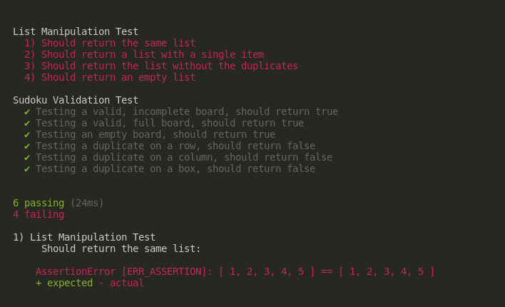

# Desafio Técnico 
### Processo Seletivo Novatics - Estágio em Desenvolvimento

##### Problema 1: Manipulando listas

A solução se encontra no arquivo `list_manipulation.js`.
Problema bem simples, exige apenas ordenar a lista e deletar as duplicatas.

##### Problema 2: Validando Sudoku

A solução se encontra no arquivo `sudoku_validation.js`.

###### A validação de um tabuleiro de Sudoku depende de 3 regras:

- Checar duplicatas em cada Linha;
- Checar duplicatas em cada Coluna;
- Checar duplicatas em cada Box;

Como não sabemos se a entrada será um jogo com o tabuleiro todo preenchido ou incompleto, é preciso investigar de forma exaustiva, isto é, checar todas as linhas, todas as colunas e todas as boxes para garantir que não há nenhum erro.
Caso uma duplicata seja achada em qualquer destas competências, não é preciso validar o resto do tabuleiro, o programa já pode afirmar que há um erro no jogo.

###### Testes

Testes unitários foram realizados para confirmar que as soluções implementadas estão corretas.

Os testes da validação do Sudoku correm sem problemas. Porém, nos testes da manipulação de lista, há `Assertion Error` para cada teste seguido de `npm ERR! code ELIFECYCLE`, que não pude resolver até o momento. De qualquer forma, o Log de testes mostra que o teste retorna o que deveria, então Task Failed Successfully :).

